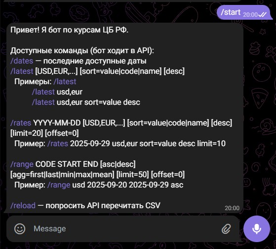
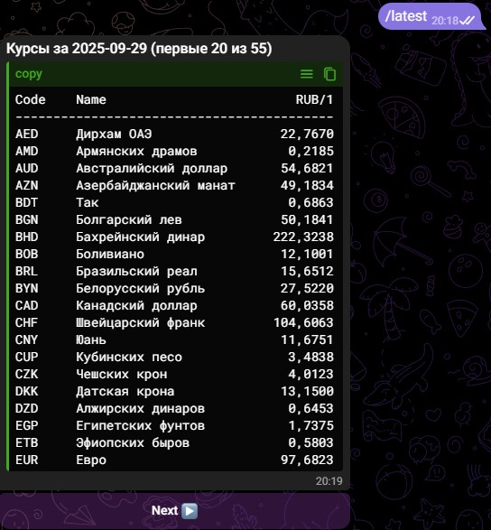
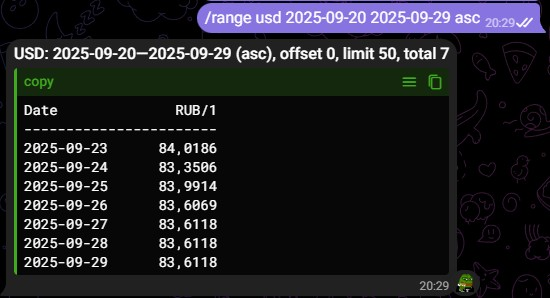
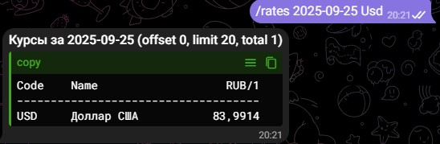
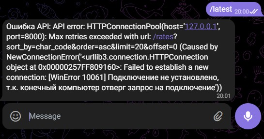

# 📊 CBR Currency Rates Scraper

This project automatically collects daily currency rates from the official [Central Bank of Russia](https://www.cbr.ru/currency_base/daily/) website using **Selenium** and generates plots showing changes over a selected period.

## ⚙️ Features

- Scrapes **all currencies** from the CBR daily table.
- Collects data for **today** and several previous calendar days.
- Saves HTML dumps and per-day CSV files.
- Builds:
  - **Indexed chart** (all currencies normalized to 100 on the first day).
  - **Absolute chart** (RUB per 1 unit of currency).
- Supports currency filtering (`--pick USD EUR CNY`).
- Supports headless mode (runs without opening a browser window).


## 📦 Installation

1. Clone or download the project.  
2. Install dependencies:
   ```bash
   pip install -r requirements.txt


Collect for the last week (with browser window visible)

```python cbr_selenium_scraper.py --days 7```

Collect for the last 10 days in headless mode

```python cbr_selenium_scraper.py --days 10 --headless```

Generate chart only for selected currencies

```python cbr_selenium_scraper.py --days 7 --pick USD EUR CNY```

to start API
run: 
```cd \cbrf_rates\api```
```uvicorn app:app --reload --port 8000```
and then run bot.py
```python bot.py```

```
curl 
http://127.0.0.1:8000/health
```
```
curl 
http://127.0.0.1:8000/dates
```
```
curl 
"http://127.0.0.1:8000/rates?date=2025-09-29&codes=USD,EUR&sort_by=value_per_unit&order=desc&limit=10"
```
```
curl 
"http://127.0.0.1:8000/range?code=USD&start=2025-09-20&end=2025-09-29&order=asc"
```

telegram bot:
for start you need telegram token
. env file
```
TELEGRAM_TOKEN=ваш_токен_бота
API_BASE=http://127.0.0.1:8000
```
```
python bot/bot.py
```


Examples of bot working:







